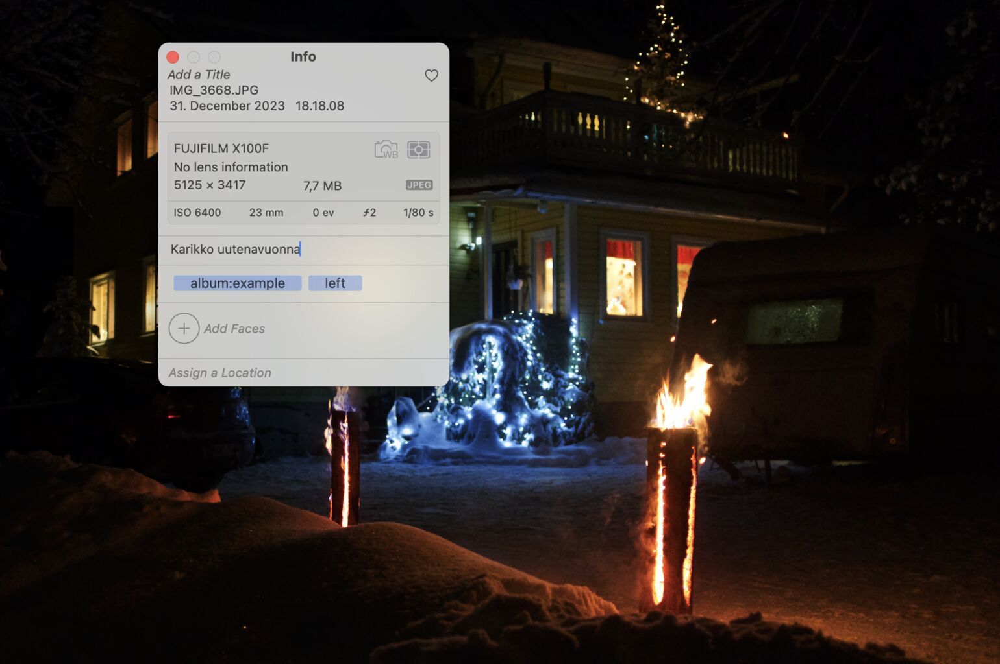

# Apple photos + ImageMagick + ExifTool text overlay

This is a personal project to add photo descriptions as an overlay to the image files
before ordering them as prints (for christmas gifts).

The idea is to use Apple Photos to add descriptions (or "captions") and optional keywords
to photos, export them and overlay date and description to the photo with this script.

## Image options



Description goes to the caption-field. Linefeeds can be added with option-enter, but
ExifTool will output them as dots, so dots cannot be added to the text.

Possible keywords and their functionalities are:
- "left": default overlay position is in bottom right corner, with "left" it can be
  placed to bottom left corner.
- "title": create a title image with larger text positioned in bottom center. This option
  also omits the date from overlay.
- "album:<album name>" prefix output filenames with `<album name>-`. Defaults to `all-`.

## Usage

Install `exiftool` and `imagemagick`:

``` sh
brew install exiftool
brew install imagemagick
```

Export images from Apple Photos.

Configure `.env` to point to your photo export and desired output paths (example 
configuration in `.env-example`).

Run `overlay.sh`


